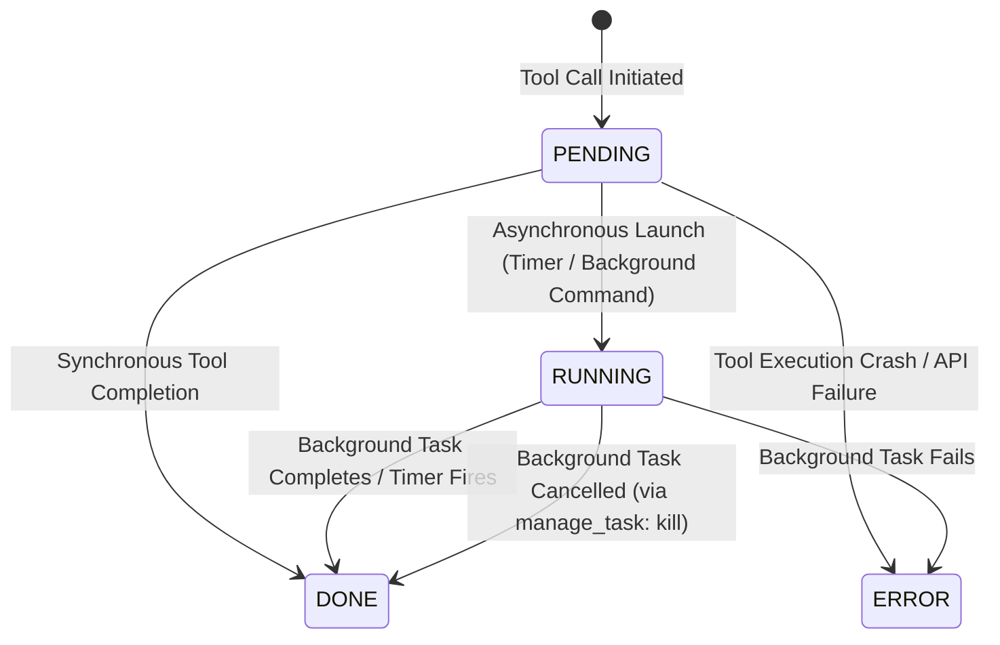

# Antigravity Transcript Format & Step Types Specification

This document provides a comprehensive, rigorous reference for the file format, envelope schema, step types, lifecycle statuses, and sidecar conventions used in Google Antigravity session transcripts (`transcript_full.jsonl` and `transcript.jsonl`).

> [!NOTE]
> **Target Audience**: This specification is optimized for downstream AI agents, automated eval harnesses, log indexers, and developer tooling that need to parse, analyze, or synthesize Antigravity agent interactions.
> Companion JSON Schema: [`antigravity_transcript_schema.json`](file:///home/nob/Documents/ecc-dev3/docs/antigravity_transcript_schema.json)

---

## 1. Storage Topology & Architecture

Antigravity persists all agent conversations under the local user application directory:
`<appDataDir>/brain/<conversation-id>/` (default Linux path: `~/.gemini/antigravity/brain/<conversation-id>/`).

### Directory Layout

```
~/.gemini/antigravity/brain/<conversation-id>/
├── .system_generated/
│   ├── logs/
│   │   ├── transcript_full.jsonl        # Complete, untruncated transcript (Primary)
│   │   ├── transcript.jsonl             # Token-efficient compact log (truncated text)
│   │   └── chunks/
│   │       ├── transcript/              # Paginated 8-digit chunk slices (e.g. 00000000.jsonl)
│   │       └── transcript_full/         # Paginated full chunk slices
│   ├── steps/
│   │   └── <step_index>/
│   │       └── content.md               # Offloaded web captures (from read_url_content)
│   └── tasks/
│       └── <task-id>.log                # Live logs for async background tasks
├── .user_uploaded/                      # User-provided session attachments
├── scratch/                             # Persistent agent scratchpad files & scripts
├── implementation_plan.md               # Active planning artifact (when Planning Mode active)
└── walkthrough.md                       # Verification and completion walkthrough artifact
```

### Transcript Types Comparison

| Attribute | `transcript_full.jsonl` | `transcript.jsonl` |
| :--- | :--- | :--- |
| **Completeness** | 100% full content, complete thought traces | Truncates large text fields (>40 KB or long code blocks) |
| **Line Mapping** | 1-to-1 line mapping with `transcript.jsonl` | 1-to-1 line mapping with `transcript_full.jsonl` |
| **Field Truncation Flag** | Absent (`truncated_fields` not present) | Present when truncated: `"truncated_fields": ["content"]` |
| **Primary Use Case** | Deep forensic analysis, log synthesis, evals | Rapid token-efficient browsing by LLMs |

---

## 2. Universal Envelope Schema

Every single line in `transcript_full.jsonl` and `transcript.jsonl` is an independent, valid JSON object following this envelope structure:

```json
{
  "step_index": 42,
  "source": "MODEL",
  "type": "GENERIC",
  "status": "DONE",
  "created_at": "2026-08-28T04:51:00Z",
  "content": "...",
  "thinking": "...",
  "tool_calls": [ ... ],
  "exit_code": 0,
  "error": "...",
  "error_code": 500,
  "truncated_fields": [ ... ]
}
```

### Envelope Field Definitions

| Field | Type | Required? | Enum / Values | Description |
| :--- | :--- | :---: | :--- | :--- |
| `step_index` | `integer` | **Yes** | `>= 0` | Monotonically increasing 0-indexed step number. |
| `source` | `string` | **Yes** | `USER_EXPLICIT`<br>`SYSTEM`<br>`SYSTEM_SDK`<br>`MODEL` | Originating actor of the step. `SYSTEM_SDK` denotes hooks/SDK runtime injections. |
| `type` | `string` | **Yes** | See Step Types Table | Categorical type defining payload semantics. |
| `status` | `string` | **Yes** | `DONE`<br>`RUNNING`<br>`ERROR`<br>`PENDING` | Lifecycle status of this step execution. |
| `created_at` | `string` | **Yes** | ISO-8601 UTC string | Timestamp when the step was committed (e.g. `2026-08-28T04:51:00Z`). |
| `content` | `string` | *Optional* | Text / ANSI / Markdown | Step payload: user prompt, tool stdout/stderr, diff, or notification. |
| `thinking` | `string` | *Optional* | Raw monologue | Internal chain-of-thought trace (only on `PLANNER_RESPONSE`). |
| `tool_calls` | `array` | *Optional* | `[{"name": "...", "args": {...}}]` | Array of tool calls requested by the model. |
| `exit_code` | `integer` | *Optional* | `0, 1, 42, 127...` | Shell exit code (present in command steps). |
| `error` | `string` | *Optional* | Error message string | Present on `ERROR_MESSAGE` steps or system-level tool parsing failures. |
| `error_code` | `integer` | *Optional* | `500, 429...` | Numerical status code present on `ERROR_MESSAGE` steps. |
| `truncated_fields`| `array[str]` | *Optional* | `["content"]`, `["thinking"]`, `["tool_calls"]` | Present **only** in `transcript.jsonl` when fields are clipped. |

---

## 3. Step Types Taxonomy & Real-World Examples

### 3.1 `USER_INPUT`
* **`source`**: `USER_EXPLICIT`
* **`status`**: `DONE`
* **Description**: Captures user prompts, environment metadata, active skill injections, setting modifications, and artifact review comments.

#### Sub-Type A: Standard User Request
```json
{
  "step_index": 0,
  "source": "USER_EXPLICIT",
  "type": "USER_INPUT",
  "status": "DONE",
  "created_at": "2026-08-28T04:46:35Z",
  "content": "<USER_REQUEST>\nImplement feature XYZ\n</USER_REQUEST>\n<ADDITIONAL_METADATA>\nThe current local time is: 2026-08-28T04:46:35+07:00.\n</ADDITIONAL_METADATA>\n<USER_SETTINGS_CHANGE>\nThe user changed setting `Model Selection` from None to Gemini 3.7 Flash (High).\n</USER_SETTINGS_CHANGE>"
}
```

#### Sub-Type B: Artifact Review Approval
When a user approves a plan or document in the UI (e.g. clicking the "Proceed" or "Approve plan" button on an artifact):
```json
{
  "step_index": 59,
  "source": "USER_EXPLICIT",
  "type": "USER_INPUT",
  "status": "DONE",
  "created_at": "2026-08-28T04:49:41Z",
  "content": "Comments on artifact URI: file:///home/nob/.gemini/antigravity/brain/cfb4dce2-f6f3-4788-b06f-e11e2c30eb7a/implementation_plan.md\n\nThe user has approved this document.\n\n\n<USER_REQUEST>\n\n</USER_REQUEST>\n<ADDITIONAL_METADATA>\nThe current local time is: 2026-08-28T04:49:41+07:00.\n</ADDITIONAL_METADATA>"
}
```

#### Sub-Type C: Artifact Inline Review Comments / Modifications
When a user highlights sections or leaves line-specific change requests on an artifact:
```json
{
  "step_index": 65,
  "source": "USER_EXPLICIT",
  "type": "USER_INPUT",
  "status": "DONE",
  "created_at": "2026-08-28T05:02:10Z",
  "content": "Comments on artifact URI: file:///home/nob/.gemini/antigravity/brain/cfb4dce2-f6f3-4788-b06f-e11e2c30eb7a/implementation_plan.md\n\nLine 42: Please switch the fallback database to SQLite instead of Postgres.\nLine 88: Add unit tests for edge case timeouts.\n\n<USER_REQUEST>\nPlease apply these modifications to the plan before proceeding.\n</USER_REQUEST>"
}
```

#### Common XML Enclosures Inside `content`:
1. `<USER_REQUEST>`: The verbatim prompt submitted by the human user.
2. `<ADDITIONAL_METADATA>`: Environment data including local time, workspace path mappings, and mentioned items.
3. `<SKILL>`: Prompt injection when a workflow skill is triggered (e.g., `/plan`).
4. `<USER_SETTINGS_CHANGE>`: Settings adjusted in the IDE UI (model changes, temperature, thinking budgets).

---

### 3.2 `CHECKPOINT`
* **`source`**: `SYSTEM`
* **`status`**: `DONE`
* **Description**: Generated by Antigravity's context compaction engine when a conversation exceeds token thresholds. Summarizes prior objective, chronologically numbered requests, and log references.

```json
{
  "step_index": 1,
  "source": "SYSTEM",
  "type": "CHECKPOINT",
  "status": "DONE",
  "created_at": "2026-08-28T04:46:35Z",
  "content": "{{ CHECKPOINT 0 }}\n **The earlier parts of this conversation have been truncated due to its long length. The following content summarizes the truncated context so that you may continue your work. **\n\n# USER Objective:\nAntigravity Transcript Format Synthesis\n\n# User Requests\n1. /plan Investigate and synthesize format of all step types...\n\n# Conversation Logs\n- /home/nob/.gemini/antigravity/brain/cfb4dce2-f6f3-4788-b06f-e11e2c30eb7a/.system_generated/logs/transcript.jsonl"
}
```

---

### 3.3 `CONVERSATION_HISTORY`
* **`source`**: `SYSTEM`
* **`status`**: `DONE`
* **Description**: Boundary marker inserted by the framework representing turn transitions or session resumption.

```json
{
  "step_index": 34,
  "source": "SYSTEM",
  "type": "CONVERSATION_HISTORY",
  "status": "DONE",
  "created_at": "2026-08-14T04:17:22Z"
}
```

---

### 3.4 `SYSTEM_MESSAGE`
* **`source`**: `SYSTEM`
* **`status`**: `DONE`
* **Description**: Asynchronous event bus delivery. Delivers incoming subagent messages, one-shot/cron timer expirations, and background task lifecycle events directly into context.

```json
{
  "step_index": 89,
  "source": "SYSTEM",
  "type": "SYSTEM_MESSAGE",
  "status": "DONE",
  "created_at": "2026-08-27T21:51:08Z",
  "content": "The following is a <SYSTEM_MESSAGE> not actually sent by the user. It is provided by the system as important information to pay attention to.\n\n<SYSTEM_MESSAGE>\n[Message] timestamp=2026-08-27T21:51:08Z sender=cfb4dce2-f6f3-4788-b06f-e11e2c30eb7a/task-83 priority=MESSAGE_PRIORITY_LOW content=Task id \"cfb4dce2-f6f3-4788-b06f-e11e2c30eb7a/task-83\" was canceled with result:\nTool execution was canceled\n</SYSTEM_MESSAGE>"
}
```

#### Message Priority Levels:
* `MESSAGE_PRIORITY_HIGH`: Urgent notifications, subagent responses (`send_message`), scheduled timer alerts.
* `MESSAGE_PRIORITY_LOW`: Background task status updates, task cancellation confirmations.

---

### 3.5 `EPHEMERAL_MESSAGE`
* **`source`**: `SYSTEM` | `SYSTEM_SDK`
* **`status`**: `DONE`
* **Description**: In-context notifications, warnings, and reminders injected by the harness or SDK plugins (e.g. governance secret detection, hook warnings, active instincts, loop detection warnings). These are ephemeral and are omitted during context compaction.

```json
{
  "step_index": 16,
  "source": "SYSTEM_SDK",
  "type": "EPHEMERAL_MESSAGE",
  "status": "DONE",
  "created_at": "2026-08-24T23:18:26Z",
  "content": "WARNING: [ECC Hook Warnings]\n[governance] secret_detected in tool input: aws_key"
}
```

---

### 3.6 `ERROR_MESSAGE`
* **`source`**: `SYSTEM`
* **`status`**: `DONE`
* **Description**: System-level failure events such as model output parsing failures (invalid tool call parameters before execution) or remote model 500 internal errors. Contains the `error` string and optional integer `error_code`.

```json
{
  "step_index": 445,
  "source": "SYSTEM",
  "type": "ERROR_MESSAGE",
  "status": "DONE",
  "error": "The model encountered an internal error.",
  "error_code": 500,
  "created_at": "2026-08-14T20:01:50Z",
  "content": "Error: The model encountered an internal error."
}
```

---

### 3.7 `PLANNER_RESPONSE`
* **`source`**: `MODEL`
* **`status`**: `DONE`
* **Description**: The core generative model step. Contains optional `thinking` (chain of thought), user-facing text in `content`, and pending tool invocations in `tool_calls`.

```json
{
  "step_index": 82,
  "source": "MODEL",
  "type": "PLANNER_RESPONSE",
  "status": "DONE",
  "created_at": "2026-08-27T21:51:01Z",
  "thinking": "**Executing Command**\n\nI need to launch a background task to verify async tracking...",
  "tool_calls": [
    {
      "name": "run_command",
      "args": {
        "CommandLine": "sleep 30",
        "Cwd": "/home/nob/Documents/ecc-dev3",
        "WaitMsBeforeAsync": 100,
        "toolAction": "Launching background sleep command",
        "toolSummary": "Launch background task"
      }
    }
  ]
}
```

---

### 3.8 `GENERIC` (Unified Tool Execution Envelope)
* **`source`**: `MODEL`
* **`status`**: `DONE` | `RUNNING` | `ERROR`
* **Description**: Antigravity's unified tool execution result envelope. Wraps output from built-in file tools, MCP servers, subagent operations, and search operations.

#### Case A: Synchronous Tool Execution Success (`status: "DONE"`)
```json
{
  "step_index": 80,
  "source": "MODEL",
  "type": "GENERIC",
  "status": "DONE",
  "created_at": "2026-08-27T21:51:00Z",
  "content": "Created At: 2026-08-28T04:51:00+07:00\nCompleted At: 2026-08-28T04:51:01+07:00\n\n\t\t\t\tThe command exited with code 0.\n\t\t\t\tOutput:\n\t\t\t\tAntigravity sync command success\r\n\n"
}
```

#### Case B: Asynchronous Background Task Initialized (`status: "RUNNING"`)
```json
{
  "step_index": 83,
  "source": "MODEL",
  "type": "GENERIC",
  "status": "RUNNING",
  "created_at": "2026-08-27T21:51:02Z",
  "content": "Created At: 2026-08-28T04:51:02+07:00\nTool is running as a background task with task id: cfb4dce2-f6f3-4788-b06f-e11e2c30eb7a/task-83\nTask Description: sleep 30\nTask logs are available at: file:///home/nob/.gemini/antigravity/brain/cfb4dce2-f6f3-4788-b06f-e11e2c30eb7a/.system_generated/tasks/task-83.log\nYOU MUST TAKE ONE OF THE FOLLOWING TWO ACTIONS: A) either proceed to other relevant work (if any) or, B) simply update the user with a short message... and end the turn.\n DO NOTHING ELSE."
}
```

#### Case C: MCP Server Tool Result (`call_mcp_tool`)
```json
{
  "step_index": 62,
  "source": "MODEL",
  "type": "GENERIC",
  "status": "DONE",
  "created_at": "2026-08-27T21:49:47Z",
  "content": "Created At: 2026-08-28T04:49:47+07:00\nCompleted At: 2026-08-28T04:50:39+07:00\n{\"success\":true,\"decks\":[{\"name\":\"Default\"},{\"name\":\"Online Dictionary Helper\"}],\"total\":2}"
}
```

#### Case D: Subagent Spawning (`invoke_subagent`)
```json
{
  "step_index": 70,
  "source": "MODEL",
  "type": "GENERIC",
  "status": "DONE",
  "created_at": "2026-08-27T21:50:52Z",
  "content": "Created At: 2026-08-28T04:50:52+07:00\nCompleted At: 2026-08-28T04:50:52+07:00\nCreated the following subagents:\n{\n  \"conversationId\":  \"4d2584f1-af7d-4133-bc9d-fb47d50f533c\",\n  \"logAbsoluteUri\":  \"file:///home/nob/.gemini/antigravity/brain/4d2584f1-af7d-4133-bc9d-fb47d50f533c/.system_generated/logs/transcript.jsonl\",\n  \"workspaceUris\":  [\n    \"file:///home/nob/Documents/ecc-dev3\"\n  ]\n}\nThe subagents will send you a message when they have completed their task or require guidance. There is no need to poll for their responses."
}
```

#### Case E: File Mutation Diff (`replace_file_content`)
```json
{
  "step_index": 93,
  "source": "MODEL",
  "type": "GENERIC",
  "status": "DONE",
  "created_at": "2026-08-27T21:51:12Z",
  "content": "Created At: 2026-08-28T04:51:12+07:00\nCompleted At: 2026-08-28T04:51:12+07:00\nThe following changes were made by the replace_file_content tool to: /path/to/file.txt.\n[diff_block_start]\n@@ -1,4 +1,4 @@\n Line 1: Hello Antigravity\n-Line 2: Target to replace\n+Line 2: Target replaced successfully\n Line 3: End of file\n[diff_block_end]"
}
```

#### Case F: Interactive Question Modal (`ask_question`)
```json
{
  "step_index": 112,
  "source": "MODEL",
  "type": "GENERIC",
  "status": "DONE",
  "created_at": "2026-08-28T05:04:20Z",
  "content": "Created At: 2026-08-28T05:04:20+07:00\nCompleted At: 2026-08-28T05:04:22+07:00\nUser selected option: \"(Recommended) Use SQLite as the local database fallback\""
}
```

---

### 3.9 Specialized & Legacy Step Types

In certain Antigravity runtime profiles or earlier sessions, individual tools emit dedicated step types rather than the unified `GENERIC` envelope:

| Type | Specialized Fields in Envelope | Typical Content Structure |
| :--- | :--- | :--- |
| `RUN_COMMAND` | `exit_code: <int>`<br>`status: "DONE" \| "RUNNING"` | `\t\t\t\tThe command exited with code X.\n\t\t\t\tStdout:\n...\n\t\t\t\tStderr:\n...` |
| `VIEW_FILE` | None | `File Path: ...\nTotal Lines: ...\nTotal Bytes: ...\nShowing lines X to Y\n<line_num>: <code_content>` |
| `LIST_DIRECTORY`| None | Stream of `{"name": "...", "isDir": true, "sizeBytes": "..."}` objects followed by `Summary:` |
| `READ_URL_CONTENT`| None | `Title: ...\nOG Description: ...\nThe full content of the article at URL has been saved to: /path/to/.system_generated/steps/<id>/content.md` |
| `INVOKE_SUBAGENT` | None | JSON object containing `conversationId`, `logAbsoluteUri`, and `workspaceUris` |
| `GREP_SEARCH` | None | JSON Lines stream of `{"File": "...", "LineNumber": N, "LineContent": "..."}` |
| `SEARCH_WEB` | None | Formatted markdown summaries with citations and source URLs |
| `ASK_QUESTION` | None | Interactive questionnaire prompt and serialized selection |
| `CODE_ACTION` | None | Code modification actions and diff application payloads |
| `MCP_TOOL` | None | Raw output returned directly from an MCP server tool invocation |

---

## 4. Skills, Rules & Plugins Architecture

Antigravity uses a progressive disclosure architecture for skills, rules, and plugins:

### 4.1 Skills (Built-in vs Workspace)
* **Built-in Skills**: Shipped natively under `~/.gemini/antigravity/builtin/skills/<name>/SKILL.md` (e.g. `antigravity_guide`, `agy-customizations`).
* **Workspace Skills**: Placed under `.agents/skills/<name>/SKILL.md` in repository root.
* **Transcript Injection**: Skills are not dumped into the initial prompt. When invoked (or mentioned via slash command `/name`), the skill description and instructions are injected into `USER_INPUT` wrapped in `<SKILL>...</SKILL>`.

### 4.2 Rules
* **Configuration Files**: `GEMINI.md`, `AGENTS.md`, and `.agents/rules/*.md`.
* **Transcript Injection**: Loaded into system context or top of user turn inside `<RULE[rule_name]>...</RULE>`. Rules enforce guardrails (e.g., `<RULE[user_global]>` prohibiting raw `cat`/`grep` terminal commands).

### 4.3 Plugins
* **Configuration**: `plugins/<name>/plugin.json`.
* **Role**: Bundles related skills, rules, hooks, and MCP servers into an installable manifest.

---

## 5. Subagents & Browser Subagent Architecture

### 5.1 Subagent Multi-Conversation Model
Subagents in Antigravity do not pollute the parent transcript with intermediate reasoning. Instead:
1. The parent calls `invoke_subagent`.
2. Antigravity spawns an entirely independent brain workspace at:
   `/home/nob/.gemini/antigravity/brain/<subagent-conversation-id>/`
3. The subagent runs in its own process, recording its own `transcript_full.jsonl`.
4. When done, the subagent invokes `send_message(Recipient=<parent-id>, Message="...")`.
5. Antigravity injects a `SYSTEM_MESSAGE` step into the parent's `transcript_full.jsonl` with:
   `[Message] timestamp=... sender=<subagent-conversation-id> priority=MESSAGE_PRIORITY_HIGH content=...`

### 5.2 Custom Agents vs Built-in Agents
* **Built-in Agents**: Statically available agents (`research`, `code-reviewer`, `code-architect`, `planner`, `security-reviewer`).
* **Custom Agents**: Dynamically created during a conversation via `define_subagent(name, description, system_prompt, enable_write_tools, enable_mcp_tools)`. Once defined, they can be invoked via `invoke_subagent(TypeName="<custom-name>")`.

### 5.3 Browser Subagents
Specialized browser subagents (such as `browser-qa` or `e2e-runner`) execute browser automation workflows via Playwright / Chrome DevTools Protocol. Browser screenshots and trace zip files are offloaded directly to `.system_generated/steps/<id>/` and embedded as markdown artifacts.

---

## 6. Lifecycle & Status Transition State Machine



### Transcript Status Enum vs Internal Subagent/Task State:

| Transcript `status` | Where Used | Description |
| :--- | :--- | :--- |
| `DONE` | `transcript_full.jsonl` | Step completed execution (including commands that exited with non-zero codes). |
| `RUNNING` | `transcript_full.jsonl` | Asynchronous background task currently executing. |
| `ERROR` | `transcript_full.jsonl` | Tool execution crashed, schema validation failed, or quota exhausted. |
| `PENDING` | `transcript_full.jsonl` | Step queued or awaiting dispatch. |

| Internal Task `state` | Reported via `manage_task` / `manage_subagents` | Description |
| :--- | :--- | :--- |
| `running` | `manage_task`, `manage_subagents` | Process actively executing CPU / I/O instructions. |
| `waiting_for_input`| `manage_subagents` | Agent blocked waiting for user modal selection (`ask_question`). |
| `waiting_for_dependents`| `manage_subagents` | Parent agent waiting for spawned child subagents. |
| `waiting_for_message`| `manage_subagents` | Agent idle in reactive loop waiting for incoming bus message. |
| `canceling` | `manage_task`, `manage_subagents` | Termination signal issued; cleanup in progress. |
| `errored` | `manage_task`, `manage_subagents` | Task or subagent crashed with unhandled exception. |
| `idle` | `manage_subagents` | Finished current turn, awaiting new message. |

---

## 7. Error, Warning, and Edge Case Representations

Antigravity uses distinct mechanisms to report errors depending on where the failure occurs in the execution stack:

### 7.1 In-Band Process Failures (Non-Zero Exit Codes)
* **Status**: `DONE` (The tool executed to completion, but the child process returned non-zero).
* **Envelope Representation**:
  ```json
  {
    "step_index": 81,
    "source": "MODEL",
    "type": "GENERIC",
    "status": "DONE",
    "exit_code": 42,
    "created_at": "2026-08-27T21:51:01Z",
    "content": "Created At: 2026-08-28T04:51:01+07:00\nCompleted At: 2026-08-28T04:51:01+07:00\n\n\t\t\t\tThe command exited with code 42.\n\t\t\t\tStdout:\n\t\t\t\t\n\t\t\t\tStderr:\n\t\t\t\t\n"
  }
  ```

### 7.2 Security & Sandbox Violations
* **Status**: `DONE` with `exit_code: 6` or sandbox banner:
  ```
  There were sandbox errors that may or may not be related to the failure.
  ```

### 7.3 Fuzzy Modification Warnings
* When an edit target cannot be matched exactly, `replace_file_content` logs a warning banner:
  ```
  We did our best to apply changes despite some inaccuracies. Double check if the edit applied is what you intended.
  ```

### 7.4 Cloud Provider Quotas & Rate Limits
* When remote multimodal APIs (such as `generate_image`) exceed quotas, the raw RPC error is serialized directly into `content`:
  ```json
  "content": "Encountered error in tool execution: failed to generate content: 429 Too Many Requests, body: {\"error\": {\"code\": 429, \"message\": \"You have exhausted your capacity on this model...\", \"status\": \"RESOURCE_EXHAUSTED\"}}"
  ```

### 7.5 Framework Pre-Dispatch Validation Rejections
* If a tool is called with invalid parameters or permissions are rejected before execution, Antigravity intercepts the call at the cortex layer:
  ```
  Encountered error in tool execution: declaring permissions: cortex tool <name>: convert tool call for permissions: model output error: invalid tool call error (invalid_args)
  ```
  *Note: These intercepted calls do not commit a success step to `transcript_full.jsonl`; the next step index advances to the model's recovery step.*

---

## 8. Comprehensive Tool Calls Catalog: Names, Parameter Schemas & Value Constraints

In a `PLANNER_RESPONSE` step, the `tool_calls` array contains objects structured as:
```json
{
  "name": "<tool_name>",
  "args": { ... }
}
```

> [!IMPORTANT]
> **Universal Tool Metadata**: Every built-in Antigravity tool requires two human-readable metadata parameters:
> * `toolAction` (`string`): Brief 2–5 word summary of the action being performed, capitalized like a sentence (e.g. `"Viewing file"`, `"Running command"`, `"Calling MCP tool"`).
> * `toolSummary` (`string`): Brief 2–5 word noun phrase describing what the tool call is about, capitalized like a sentence (e.g. `"File inspection"`, `"Command execution"`, `"List decks"`).

### 8.1 Tool Names (`tool_calls[i].name`) Exhaustive List

Antigravity tools fall into three naming categories:
1. **Built-in System Tools** (22 standard tools):
   `run_command`, `view_file`, `write_to_file`, `replace_file_content`, `multi_replace_file_content`, `list_dir`, `grep_search`, `find_by_name`, `search_web`, `read_url_content`, `read_browser_page`, `generate_image`, `manage_task`, `schedule`, `define_subagent`, `invoke_subagent`, `manage_subagents`, `send_message`, `ask_question`, `call_mcp_tool`, `list_resources`, `read_resource`.
2. **Eagerly-Loaded MCP Tools**:
   Dynamic naming pattern `mcp_<ServerName>_<ToolName>` (e.g. `mcp_anki-mcp_listDecks`).
3. **Dynamic / Custom Tools**:
   Custom tools exposed by active plugins or defined via session configuration.

---

### 8.2 Parameter Schemas (`tool_calls[i].args`) by Tool

#### 1. `run_command`
Runs shell commands on the host OS (Linux bash).
* **Required Parameters**:
  * `CommandLine` (`string`): Exact command line string to execute.
  * `Cwd` (`string`): Current working directory path.
  * `WaitMsBeforeAsync` (`integer`, 0–10000): Milliseconds to wait before converting process to a background task.
  * `toolAction` (`string`)
  * `toolSummary` (`string`)
* **Optional Parameters**:
  * `IsDaemon` (`boolean`): Set to `true` for long-running support servers.
  * `RunPersistent` (`boolean`): Preserves shell environment variables across calls.
  * `RequestedTerminalID` (`string`): Terminal session ID returned from previous persistent run.

#### 2. `view_file`
Reads contents of text and binary files without invoking shell utilities.
* **Required Parameters**:
  * `AbsolutePath` (`string`): Absolute file path to inspect.
  * `toolAction` (`string`)
  * `toolSummary` (`string`)
* **Optional Parameters**:
  * `StartLine` (`integer`, `>= 1`): 1-indexed start line (inclusive).
  * `EndLine` (`integer`, `>= StartLine`): 1-indexed end line (inclusive, max 800 lines/call).
  * `ContentOffset` (`integer`): Byte offset for reading past the 46080-byte view limit.
  * `IsSkillFile` (`boolean`): Set to `true` when reading instructions to execute a skill.

#### 3. `write_to_file`
Creates new files or overwrites existing files.
* **Required Parameters**:
  * `TargetFile` (`string`): Absolute target file path.
  * `CodeContent` (`string`): Content to write into the file.
  * `Description` (`string`): User-facing explanation of the file creation or update.
  * `Overwrite` (`boolean`): Must be explicitly `true` to replace existing content.
  * `toolAction` (`string`)
  * `toolSummary` (`string`)
* **Optional Parameters**:
  * `ArtifactMetadata` (`object`, required when creating `.md` artifacts):
    * `Summary` (`string`): Detailed multi-line explanation of artifact purpose.
    * `UserFacing` (`boolean`): `true` to present directly in UI, `false` for scratch files.
    * `RequestFeedback` (`boolean`): `true` to render user "Proceed" / "Feedback" buttons.

#### 4. `replace_file_content`
Atomic contiguous string replacement in an existing file.
* **Required Parameters**:
  * `TargetFile` (`string`): Absolute path to file being edited.
  * `StartLine` (`integer`): Starting line number of chunk containing target content.
  * `EndLine` (`integer`): Ending line number of chunk containing target content.
  * `TargetContent` (`string`): Exact substring to replace (including exact whitespace/indentation).
  * `ReplacementContent` (`string`): Replacement string.
  * `Instruction` (`string`): Description of the modification.
  * `Description` (`string`): User-facing change rationale.
  * `AllowMultiple` (`boolean`): `true` to allow replacing multiple identical matches.
  * `toolAction` (`string`)
  * `toolSummary` (`string`)
* **Optional Parameters**:
  * `TargetLintErrorIds` (`array[string]`): IDs of lint errors addressed by this edit.

#### 5. `multi_replace_file_content`
Applies multiple non-contiguous edits to the same file in a single atomic transaction.
* **Required Parameters**:
  * `TargetFile` (`string`): Absolute target file path.
  * `Instruction` (`string`): High-level description of changes.
  * `Description` (`string`): User-facing explanation.
  * `ReplacementChunks` (`array[object]`):
    * `StartLine` (`integer`)
    * `EndLine` (`integer`)
    * `TargetContent` (`string`)
    * `ReplacementContent` (`string`)
  * `toolAction` (`string`)
  * `toolSummary` (`string`)

#### 6. `list_dir`
Lists child files and directories.
* **Required Parameters**:
  * `DirectoryPath` (`string`): Absolute directory path.
  * `toolAction` (`string`)
  * `toolSummary` (`string`)

#### 7. `grep_search`
Ripgrep pattern search within files or directories.
* **Required Parameters**:
  * `SearchPath` (`string`): Absolute directory or file path.
  * `Query` (`string`): Literal text or regex query.
  * `toolAction` (`string`)
  * `toolSummary` (`string`)
* **Optional Parameters**:
  * `CaseInsensitive` (`boolean`): Default `false`.
  * `IsRegex` (`boolean`): Default `false`.
  * `MatchPerLine` (`boolean`): If `true`, returns line numbers and code snippets (`git grep -nI`). If `false`, returns file paths only.
  * `Includes` (`array[string]`): Glob patterns (e.g. `["*.py", "!**/vendor/*"]`).

#### 8. `find_by_name`
Fast directory file discovery via `fd`.
* **Required Parameters**:
  * `SearchDirectory` (`string`): Absolute directory path.
  * `Pattern` (`string`): Glob pattern for file/directory names.
  * `toolAction` (`string`)
  * `toolSummary` (`string`)
* **Optional Parameters**:
  * `Type` (`string`): Enum `["file", "directory", "any"]`.
  * `Extensions` (`array[string]`): Allowed file extensions without leading dot (e.g. `["ts", "tsx"]`).
  * `Excludes` (`array[string]`): Glob exclude patterns.
  * `FullPath` (`boolean`): If `true`, pattern matches the absolute path instead of filename.
  * `MaxDepth` (`integer`): Maximum directory recursion depth.

#### 9. `search_web`
Performs external web searches.
* **Required Parameters**:
  * `query` (`string`): Search query string.
  * `toolAction` (`string`)
  * `toolSummary` (`string`)
* **Optional Parameters**:
  * `domain` (`string`): Preferred domain to prioritize in search results.

#### 10. `read_url_content`
Fetches and converts public web pages to markdown via HTTP GET (no browser GUI).
* **Required Parameters**:
  * `Url` (`string`): HTTP/HTTPS URL.
  * `toolAction` (`string`)
  * `toolSummary` (`string`)

#### 11. `read_browser_page`
Captures web pages requiring JavaScript execution, cookies, or user visibility.
* **Required Parameters**:
  * `Url` (`string`): Target URL to navigate and capture.
  * `toolAction` (`string`)
  * `toolSummary` (`string`)

#### 12. `generate_image`
Generates or edits images via multimodal models.
* **Required Parameters**:
  * `Prompt` (`string`): Detailed text prompt or image editing instructions.
  * `ImageName` (`string`): Snake_case filename (max 3 words, e.g. `login_flow_mockup`).
  * `toolAction` (`string`)
  * `toolSummary` (`string`)
* **Optional Parameters**:
  * `AspectRatio` (`string`): Enum `["1:1", "2:3", "3:2", "3:4", "4:3", "9:16", "16:9"]`. Default `"1:1"`.
  * `ImagePaths` (`array[string]`, max 3): Absolute paths to reference or source images.

#### 13. `manage_task`
Manages background processes and scheduled tasks.
* **Required Parameters**:
  * `Action` (`string`): Enum `["list", "kill", "status", "send_input"]`.
  * `toolAction` (`string`)
  * `toolSummary` (`string`)
* **Conditional Parameters**:
  * `TaskId` (`string`): Required for `"kill"`, `"status"`, and `"send_input"`. Format: `<conv-id>/task-<id>`.
  * `Input` (`string`): Required for `"send_input"`.

#### 14. `schedule`
Schedules one-shot countdown timers or recurring cron triggers.
* **Required Parameters**:
  * `Prompt` (`string`): Message injected into context when timer fires or cron triggers.
  * `toolAction` (`string`)
  * `toolSummary` (`string`)
* **Mutually Exclusive Schedule Timing**:
  * `DurationSeconds` (`integer`): Countdown duration in seconds (for one-shot timers).
  * `CronExpression` (`string`): 5-field cron expression (e.g. `"*/5 * * * *"`).
* **Optional Parameters**:
  * `TimerCondition` (`string`): Enum `["never", "any", "<sender-id>"]`. Default `"never"`.
  * `MaxIterations` (`integer`): Trigger limit for cron jobs.
  * `IsDaemon` (`boolean`): If `true`, task continues firing in background after current conversation finishes.

#### 15. `define_subagent`
Registers a custom subagent type for the duration of the conversation.
* **Required Parameters**:
  * `name` (`string`): Unique agent type name used by `invoke_subagent`.
  * `description` (`string`): Role description and triggering guidelines.
  * `system_prompt` (`string`): Dedicated system prompt for the subagent.
  * `toolAction` (`string`)
  * `toolSummary` (`string`)
* **Optional Tool Permission Flags**:
  * `enable_write_tools` (`boolean`): Grants file creation, editing, and command execution.
  * `enable_subagent_tools` (`boolean`): Grants permission to define and spawn further subagents.
  * `enable_mcp_tools` (`boolean`): Grants access to MCP servers.

#### 16. `invoke_subagent`
Concurrently spawns one or more background subagents.
* **Required Parameters**:
  * `Subagents` (`array[object]`):
    * `TypeName` (`string`): Built-in agent role or custom defined subagent name.
    * `Role` (`string`): 2–5 word job title (e.g. `"Codebase Researcher"`).
    * `Prompt` (`string`): Actionable instruction prompt for the subagent.
    * `Model` (`string`, optional): Enum `["inherit", "flash_lite", "flash", "pro"]`. Default `"inherit"`.
    * `Workspace` (`string`, optional): Enum `["inherit", "branch", "share"]`. Default `"inherit"`.
  * `toolAction` (`string`)
  * `toolSummary` (`string`)

#### 17. `manage_subagents`
Monitors and controls active subagents.
* **Required Parameters**:
  * `Action` (`string`): Enum `["list", "kill", "kill_all"]`.
  * `toolAction` (`string`)
  * `toolSummary` (`string`)
* **Conditional Parameters**:
  * `ConversationIds` (`array[string]`): Required when `Action` is `"kill"`.

#### 18. `send_message`
Inter-agent communication tool for messaging subagents or peer agents.
* **Required Parameters**:
  * `Recipient` (`string`): Subagent conversation ID.
  * `Message` (`string`): Message payload content.
  * `toolAction` (`string`)
  * `toolSummary` (`string`)

#### 19. `ask_question`
Renders an interactive questionnaire modal in the user UI.
* **Required Parameters**:
  * `questions` (`array[object]`):
    * `question` (`string`): Prompt question to present.
    * `options` (`array[string]`): Selectable responses (minimum 2 options).
    * `is_multi_select` (`boolean`, optional): Default `false`.
  * `toolAction` (`string`)
  * `toolSummary` (`string`)

#### 20. `call_mcp_tool`
Executes a tool on a lazily-loaded MCP server.
* **Required Parameters**:
  * `ServerName` (`string`): Name of the MCP server (e.g. `"anki-mcp"`).
  * `ToolName` (`string`): Tool method on the server (e.g. `"listDecks"`, `"addNote"`).
  * `Arguments` (`object`): JSON key-value arguments required by the target MCP tool schema.
  * `toolAction` (`string`)
  * `toolSummary` (`string`)

#### 21. `list_resources`
Discovers available resources provided by an MCP server.
* **Required Parameters**:
  * `ServerName` (`string`): Target MCP server name.
  * `toolAction` (`string`)
  * `toolSummary` (`string`)

#### 22. `read_resource`
Reads contents of an MCP resource by URI.
* **Required Parameters**:
  * `ServerName` (`string`): Target MCP server name.
  * `Uri` (`string`): Resource URI (e.g. `"system://info"`).
  * `toolAction` (`string`)
  * `toolSummary` (`string`)

---

## 9. Parsing Transcripts: AI Agent Implementation Guide

Downstream AI agents processing Antigravity transcripts can use this reference Python parser to correctly handle JSONL streaming, unpack offloaded files, and extract tool calls:

```python
import json
import re
from pathlib import Path
from typing import Generator, Dict, Any, Optional

def parse_antigravity_transcript(transcript_path: Path) -> Generator[Dict[str, Any], None, None]:
    """
    Streams steps from an Antigravity transcript_full.jsonl file.
    Resolves offloaded web content references automatically.
    """
    brain_dir = transcript_path.parents[2]  # Resolve <brain>/<conv_id>/

    with open(transcript_path, "r", encoding="utf-8") as f:
        for line_num, line in enumerate(f, start=1):
            line = line.strip()
            if not line:
                continue
            step = json.loads(line)

            # Resolve offloaded read_url_content files if referenced
            content = step.get("content", "")
            if "The full content of the article at" in content and ".system_generated/steps/" in content:
                match = re.search(r"saved to: (/[^\s]+\.md)", content)
                if match:
                    offloaded_file = Path(match.group(1))
                    if offloaded_file.exists():
                        step["offloaded_content"] = offloaded_file.read_text(encoding="utf-8")

            yield step

# Example extraction of all tool calls and statuses
def audit_session(transcript_path: Path):
    for step in parse_antigravity_transcript(transcript_path):
        idx = step["step_index"]
        stype = step["type"]
        status = step["status"]

        if stype == "PLANNER_RESPONSE" and "tool_calls" in step:
            for tc in step["tool_calls"]:
                name = tc["name"]
                args = tc.get("args", {})
                if isinstance(args, str):
                    try:
                        args = json.loads(args)
                    except Exception:
                        pass
                print(f"Step {idx:03d} [TOOL CALL] {name} -> action: {args.get('toolAction')}")
        elif step["source"] == "MODEL" and stype != "PLANNER_RESPONSE":
            print(f"Step {idx:03d} [RESP] {stype} ({status})")
        elif stype == "SYSTEM_MESSAGE":
            print(f"Step {idx:03d} [SYS_MSG] {step['content'][:60]}...")
```

---

## 10. Summary Reference Card for Agents

```
+-----------------------------------------------------------------------------------+
|                           ANTIGRAVITY TRANSCRIPT STEP                             |
+-----------------------------------------------------------------------------------+
|  Envelope Fields:                                                                 |
|    - step_index   : integer (0, 1, 2...)                                          |
|    - source       : "USER_EXPLICIT" | "SYSTEM" | "MODEL"                          |
|    - type         : "USER_INPUT" | "CHECKPOINT" | "CONVERSATION_HISTORY" |        |
|                     "SYSTEM_MESSAGE" | "PLANNER_RESPONSE" | "GENERIC" |           |
|                     "RUN_COMMAND" | "VIEW_FILE" | "LIST_DIRECTORY" | ...          |
|    - status       : "DONE" | "RUNNING" | "ERROR" | "PENDING"                      |
|    - created_at   : ISO-8601 UTC string ("2026-08-28T04:51:00Z")                  |
+-----------------------------------------------------------------------------------+
|  Tool Calls (PLANNER_RESPONSE):                                                   |
|    - tool_calls[i].name:                                                          |
|        run_command, view_file, write_to_file, replace_file_content,               |
|        multi_replace_file_content, list_dir, grep_search, find_by_name,           |
|        search_web, read_url_content, read_browser_page, generate_image,           |
|        manage_task, schedule, define_subagent, invoke_subagent,                   |
|        manage_subagents, send_message, ask_question, call_mcp_tool,               |
|        list_resources, read_resource, mcp_<server>_<tool>                         |
|    - tool_calls[i].args:                                                          |
|        Always includes: { "toolAction": str, "toolSummary": str }                 |
|        Plus tool-specific required & optional arguments (dict or JSON string)     |
+-----------------------------------------------------------------------------------+
```

